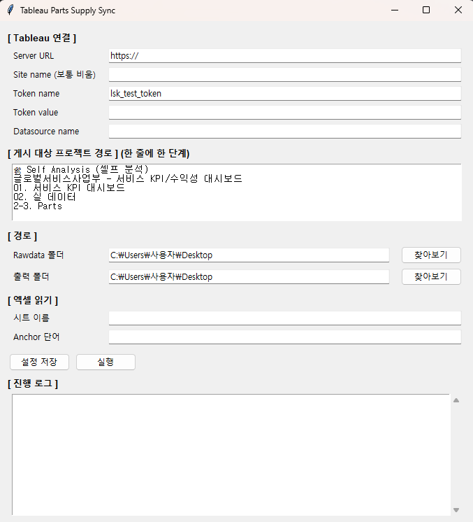

# tableau-sync

Tableau Server에서 데이터소스를 다운로드하고, Hyper 파일로 다시 덮어쓰기 게시하는 Windows GUI 도구.  
비개발자도 쓸 수 있도록 설정창 형태로 만들었고, PyInstaller로 .exe 단일 파일로 배포한다.



---

## 동작 흐름

```
Tableau Server
  └─ 데이터소스 다운로드 (.tdsx → .hyper 추출)
       └─ 데이터 처리
            └─ parts_supply.hyper 생성
                 └─ Tableau Server 지정 프로젝트에 Overwrite 게시
```

---

## 빌드 (배포하는 쪽 / Windows 1회)

준비물: Python 3.9~3.12, 인터넷 연결

```
build.bat 더블클릭
```

venv 생성 → 라이브러리 설치 → PyInstaller 빌드까지 자동 처리.  
완료되면 `dist\TableauPartsSync.exe` 생성. 이 파일 하나만 전달하면 된다.

> exe는 빌드한 것과 같은 OS/아키텍처(Windows 64bit)에서만 동작한다.

---

## 사용법 (받는 쪽 / Python 설치 불필요)

1. `TableauPartsSync.exe` 더블클릭 → 설정창이 뜬다
2. 항목을 입력한다 (아래 설정 항목 참고)
3. **설정 저장** → 다음 실행부터 자동으로 불러온다
4. **실행** → 하단 로그창에 진행 상황이 출력된다

입력한 설정은 exe 옆 `config.json`에 저장된다.

---

## 설정 항목

| 항목 | 설명 |
|---|---|
| Server URL | Tableau Server 주소 |
| Site name | 사이트명 (기본 사이트는 빈 문자열) |
| Token name | Personal Access Token 이름 |
| Token value | Personal Access Token 값 |
| Datasource name | 다운로드 및 게시할 데이터소스 이름 |
| 게시 대상 프로젝트 경로 | 중첩 프로젝트를 한 줄에 한 단계씩 입력 |
| Rawdata 폴더 | 로컬 엑셀 파일(`parts_raw*.xlsx`)이 있는 폴더 |
| 출력 폴더 | `prepdata.xlsx` 및 `.hyper` 저장 위치 |
| 시트 이름 | 엑셀에서 읽을 시트명 |
| Anchor 단어 | 헤더 행을 찾기 위한 기준 컬럼명 |

**컬럼 스키마** — `config.json`에서 직접 편집한다:

| 키 | 설명 |
|---|---|
| `text_cols` | 문자열로 읽을 컬럼 목록 (숫자 suffix `.0` 제거 대상) |
| `keep_cols` | 최종 데이터에 포함할 컬럼 순서 |
| `sum_cols` | 집계 시 합산할 컬럼 목록 |
| `mean_cols` | 집계 시 평균낼 컬럼 목록 |

**프로젝트 경로 예시** — Tableau Server의 중첩 구조를 순서대로 입력한다:

```
Top-level Project
Sub Project A
Sub Project B
```

---

## 주의사항

- **토큰은 `config.json`에 평문으로 저장**된다. 받는 사람이 본인 PAT를 발급해 쓰는 것이 안전하다.
- 백신이 PyInstaller exe를 오탐할 수 있다. 필요 시 예외 등록.
- `pantab` ↔ `tableauhyperapi` 버전 충돌로 빌드가 안 되면 `requirements.txt`에서 버전을 고정한다.  
  예: `pantab==3.0.3`

---

## 의존성

```
tableauserverclient
tableauhyperapi
pantab
```
